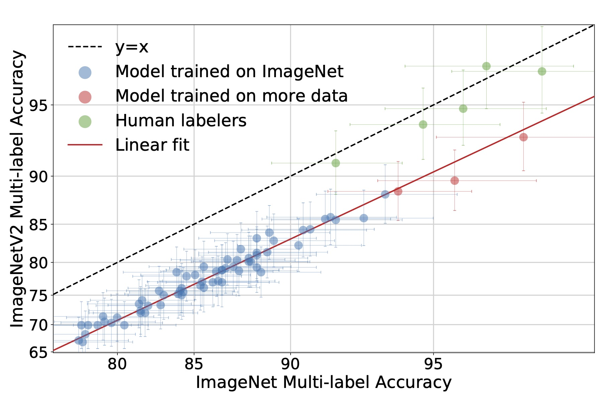

# [Evaluating Machine Accuracy on ImageNet](https://proceedings.icml.cc/static/paper_files/icml/2020/6173-Paper.pdf)
## Vaishaal Shankar\*, Rebecca Roelofs\*, Horia Mania, Alex Fang, Benjamin Recht, Ludwig Schmidt

- Generate Main Plots.ipynb : Notebook for genreating main plots from paper and accessing multi-label annotations
- human_accuracy_streamlit.py: Streamlit application for interacting with data (work in progress)
- human_accuracy.py: Wrapper class for interacting with human accuracy data from paper
- utils.py : Generic utilities
- plotter.py: Plotting utilities 
